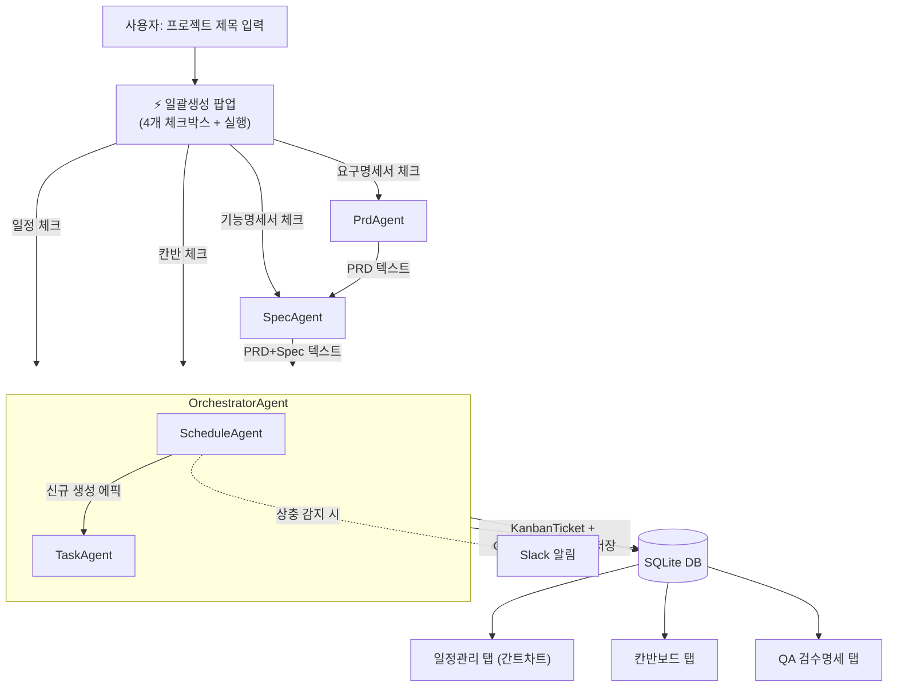

# AI Project Manager (AI PM) 프로젝트 보고서

> 본 문서는 PPT 제작을 위한 발표 자료 초안입니다. 각 섹션이 슬라이드 1~2장 분량에 대응하도록 구성했습니다.
ai융합교육학과 
2451034001
김상목
ai기술용합프로젝트 
차가을교수님

---

## 1. 프로젝트 설명

### 1.1 한 줄 소개
**요구사항 정의부터 일정 수립, 태스크 관리, QA 검수까지 소프트웨어 개발 생명주기 전 과정을 AI 에이전트와 사람이 함께 조율하는 웹 기반 협업 플랫폼**

### 1.2 배경 및 문제의식
- 일반적인 프로젝트 관리 툴(Jira, Trello 등)은 "기록"은 잘 하지만, 기획서 → 일정 → 태스크로 이어지는 **초기 분해 작업**은 여전히 PM이 수작업으로 수행해야 함
- 기획서(PRD)와 기능명세서(Spec) 사이의 논리적 모순이나 기존 시스템과의 충돌은 사람이 놓치기 쉬움
- QA 검수 없이 "완료" 처리되는 티켓으로 인한 품질 저하 문제
 
### 1.3 핵심 컨셉 — Spec-Driven Development (SDD)
프로젝트 제목 한 줄 → **PRD(요구명세서)** → **Spec(기능명세서)** → **일정(에픽/WBS)** → **칸반 태스크 + QA 체크리스트** 순으로, 각 산출물이 AI 에이전트에 의해 이전 단계 결과물을 입력으로 자동 생성되는 구조를 지향합니다. 사람은 각 단계 산출물을 검토·수정(Human-in-the-Loop)하며, 최종적으로 PM/QA 승인 없이는 완료 처리가 불가능한 **하드 게이트**를 둡니다.

### 1.4 사용자 역할(Role) 체계
| 역할 | 권한 요약 |
|---|---|
| **PM** | 프로젝트/일정 생성, AI 자동 생성 실행, 티켓 담당자 배정, QA 최종 승인(APPROVED) |
| **DEVELOPER / DESIGNER** | 본인에게 배정된 티켓 조회·상태 변경, 본인 배정/해제만 가능 |
| **QA** | 기능/품질 검수 항목의 성공(PASS)/실패(FAIL) 판정 |

### 1.5 품질 방어 장치
- **하드 게이트**: 연계된 모든 QA 검수 항목이 `APPROVED`가 되어야만 티켓이 `DONE`으로 전이 가능
- **상충 자동 감지**: PRD·Spec·기존 DB/API 설계 간 논리적 모순을 AI가 감지하면 `[AI-Detected]` 경고 카드를 자동 생성하고 Slack으로 실시간 통보
- **다국어 정규화**: 입력 문서가 영어여도 산출물(PRD, Spec, 일정, 티켓, QA 항목)은 전량 한국어로 통일 생성

---

## 2. 기술 스택

| 영역 | 스택 |
|---|---|
| Backend | Python, FastAPI, SQLAlchemy(ORM), SQLite, Pydantic, JWT + bcrypt |
| AI/LLM | LangChain(`langchain-openai`), OpenAI GPT-4o-mini (Gemini 백업 지원) |
| Frontend | React 18, TypeScript, Vite, TailwindCSS, React Router, Axios |
| 협업/알림 | Slack Incoming Webhook |
| 방법론 | Spec-Driven Development (`.specify/` 헌법 문서 + spec/plan/tasks 템플릿) |

---

## 3. 개발 산출물

### 3.1 백엔드 산출물 (`work/backend/`)
| 파일/디렉터리 | 역할 |
|---|---|
| `main.py` | FastAPI 앱 엔트리포인트, CORS, 라우터 등록, DB 자동 생성 |
| `models.py` | ORM 모델: `User`, `Project`, `Epic`, `KanbanTicket`, `QAInspectionItem`, `ProjectSetting` |
| `schemas.py` | Pydantic 요청/응답 DTO 스키마 |
| `database.py` | SQLite 세션 팩토리, 외래키(PRAGMA) 강제 적용 |
| `auth_utils.py` | JWT 발급/검증, 비밀번호 해싱, 현재 사용자 의존성 |
| `slack_utils.py` | 동적 Webhook URL 기반 Slack 알림 발송 |
| `llm_service.py` | LLM 프롬프트 구성 및 호출 (PRD/Spec/일정/태스크 생성 로직의 실제 구현체) |
| `agents/` | **PRD/Spec/Schedule/Task 4개 서브 에이전트 + 오케스트레이터** (4절 참고) |
| `routers/` | `auth`, `users`, `projects`, `schedules`, `epics`, `tickets`, `qa` — 기능별 API 라우터 |

### 3.2 주요 API 엔드포인트
| Method | Path | 설명 |
|---|---|---|
| POST | `/api/v1/auth/signup`, `/login` | 회원가입, 로그인(JWT 발급) |
| POST | `/api/v1/projects/generate-prd` | 제목 → PRD 초안 자동 생성 (PrdAgent) |
| POST | `/api/v1/projects/generate-spec` | 제목+PRD → Spec 초안 자동 생성 (SpecAgent) |
| POST | `/api/v1/schedules/generate` | 오케스트레이터 실행 — 일정(에픽)/칸반 태스크 선택적 자동 생성 |
| GET/POST/PUT | `/api/v1/epics` | 에픽(WBS 일정) 조회/생성/수정 |
| GET/POST/PUT | `/api/v1/tickets` | 칸반 티켓 조회/생성/수정 |
| POST | `/api/v1/tickets/recommend`, `/bulk-create` | 에픽 단위 AI 태스크 추천 및 일괄 반영("인공지능 플링크") |
| PATCH | `/api/v1/qa/items/{id}` | QA 검수 상태 변경(PASS/FAIL/APPROVED), 완료 시 티켓 자동 DONE 전이 |

### 3.3 프론트엔드 산출물 (`work/frontend/src/`)
- **5대 화면 탭**: 프로젝트 생성 / 일정관리(간트차트) / 칸반보드 / 기능검수명세 / 품질검수명세
- **AI 자동 생성 UX**: 제목 옆 "⚡ 일괄생성" 팝업에서 PRD/Spec/일정/태스크 4단계를 체크박스로 선택 후 순차 실행하며 실시간 진행 상태(대기→진행중→완료)를 표시
- **간트 차트**: 에픽 라벨 열 / 날짜 헤더 / 바 그래프 3영역을 분리하고 스크롤을 단일 마스터 영역으로 동기화한 커스텀 구현
- **칸반보드**: 대기/검토/진행중/완료 4열, 컬럼별 독립 스크롤, 담당자 배정 및 QA 체크박스 연동

### 3.4 문서/설계 산출물 (SDD 산출물)
- `.specify/memory/constitution.md` — 프로젝트 헌법(개발 원칙/컨벤션)
- `specs/ai_pm_spec.md` — 기능 명세서
- `plans/db_and_api_design.md` — DB/API 설계 계획서
- `tasks/` — 세부 작업 체크리스트

---

## 4. AI 에이전트 구조 및 상호관계 (핵심)

### 4.1 설계 원칙
각 에이전트는 **단일 책임(Single Responsibility)** 을 가지며, 서로 직접 호출하지 않고 **오케스트레이터(OrchestratorAgent)** 를 통해서만 조합·실행됩니다. 이 구조 덕분에 사용자는 4개 단계 중 필요한 것만 선택적으로 실행할 수 있고, 각 에이전트는 독립적으로 테스트·교체가 가능합니다.

### 4.2 에이전트 목록과 책임

| 에이전트 | 입력 | 출력 | 책임 |
|---|---|---|---|
| **PrdAgent** | 프로젝트 제목 | PRD(요구명세서) 초안 텍스트 | 제목만으로 배경/목표/타겟/기능요구/비기능요구/제외범위를 갖춘 PRD 작성 |
| **SpecAgent** | 프로젝트 제목 + PRD | Spec(기능명세서) 초안 텍스트 | PRD의 각 요구사항을 기능 단위로 구체화(기능목록, 상세 시나리오, 예외처리, QA 포인트) |
| **ScheduleAgent** | 제목 + PRD + Spec | 에픽(WBS) 목록 + 상충 경고 | LLM으로 대기능 단위 일정을 분해하고, DB에 Epic 레코드로 저장. 논리적 모순 발견 시 `[AI-Detected]` 경고 에픽 생성 + Slack 알림 |
| **TaskAgent** | 에픽(들) | 칸반 태스크 + QA 체크리스트 | 에픽 범위 내 실행 가능한 세부 작업을 3~5개 도출, 기능/품질 QA 항목을 함께 생성해 DB에 저장 |
| **OrchestratorAgent** | 위 4개 에이전트 + 사용자 선택 플래그 | 종합 실행 결과 | `create_schedule_board`, `create_kanban_tasks` 등 플래그에 따라 ScheduleAgent→TaskAgent를 조건부·순차 실행. 신규 생성 에픽이 있으면 그것을, 없으면 프로젝트의 기존 에픽을 태스크 생성 대상으로 재사용 |

### 4.3 상호관계 다이어그램

### 4.4 실행 시나리오별 상호관계

1. **전체 파이프라인 (4개 모두 선택)**
   `PrdAgent → SpecAgent → OrchestratorAgent(ScheduleAgent → TaskAgent)` 순으로 프론트엔드가 각 API를 순차 호출하며, 각 단계 완료 시점마다 팝업의 진행 상태 UI가 갱신됨. 이전 단계의 출력(PRD/Spec 텍스트)이 다음 단계의 입력으로 그대로 전달됨.
2. **일정만 재생성** (Spec은 이미 있음)
   PrdAgent/SpecAgent를 건너뛰고, 폼에 남아있는 기존 PRD/Spec 텍스트를 그대로 OrchestratorAgent에 전달 → ScheduleAgent만 동작.
3. **태스크만 추가 생성** (에픽은 이미 존재)
   OrchestratorAgent는 `create_schedule_board=False` 인 경우, 새로 생성된 에픽이 없으므로 **해당 프로젝트에 기존에 저장된 에픽들**을 조회하여 TaskAgent의 입력으로 재사용 — 이 재사용 로직이 오케스트레이터의 핵심 판단 지점.
4. **개별 에픽 단위 추가 추천 ("인공지능 플링크")**
   칸반보드 탭에서는 TaskAgent와 별개로 `tickets.py`의 `recommend`/`bulk-create` API가 에픽 1개를 대상으로 동일한 LLM 추천 로직을 재사용해, 기존 티켓과 중복되지 않는 추가 태스크를 선택적으로 반영할 수 있게 함.

### 4.5 왜 오케스트레이터가 필요한가
- 사용자가 선택한 옵션 조합(4개 중 1~4개)에 따라 실행해야 할 에이전트 집합과 순서가 달라짐 → 이 **조건부 순차 실행 로직**을 한 곳에 모아 라우터(API 계층)를 단순하게 유지
- 신규 생성 vs 기존 데이터 재사용 분기 등 **여러 에이전트에 걸친 상태 판단**은 개별 에이전트가 알 필요가 없는 관심사이므로 오케스트레이터가 전담
- 향후 에이전트가 추가되어도(예: 배포 승인 에이전트) 오케스트레이터의 플래그만 확장하면 되고, 기존 에이전트/라우터는 변경 불필요

---

## 5. 사용자 워크플로우 요약

1. 회원가입/로그인 (역할 선택) → JWT 인증
2. **[PM]** 프로젝트 생성 탭에서 제목 입력 → "⚡ 일괄생성"으로 PRD/Spec/일정/태스크를 한 번에 생성하거나, 각 단계를 개별 버튼으로 초안 생성 후 직접 검토·수정
3. 일정관리 탭에서 간트차트로 에픽 타임라인 확인, 상충 경고(`[AI-Detected]`) 확인
4. 칸반보드 탭에서 담당자 배정, 상태 변경(대기→검토→진행중→완료), "인공지능 플링크"로 추가 태스크 추천
5. **[QA]** 기능/품질검수명세 탭에서 PASS/FAIL 판정
6. **[PM]** 모든 QA 항목 승인(APPROVED) → 티켓 완료(DONE) 처리 가능 (하드 게이트)

---

## 6. 향후 개선 방향 (제언)
- 오케스트레이터에 배포 승인/릴리즈 노트 자동 생성 에이전트 추가
- 에이전트별 실행 이력(로그) 저장 및 재실행(재시도) 기능
- LLM 응답 스트리밍으로 생성 중 실시간 미리보기 제공
