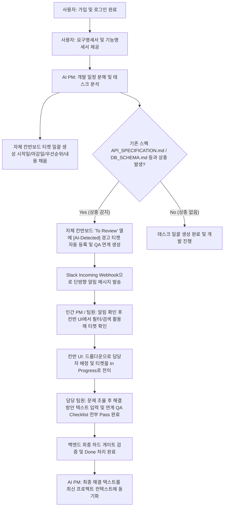

# 기능 명세서 (Specification) - 인공지능 PM (AI Project Manager)

## 1. 프로젝트 개요 (Introduction)
본 시스템은 실제 프로젝트 매니저(Human PM)를 완전히 대체하는 것이 아닌, 인간 PM과 개발 팀원 전체의 협업 생산성을 극대화하기 위해 자체 개발 칸반보드와 슬랙(Slack)을 매개체로 작동하는 **'AI 기반 협업 어시스턴트 플랫폼'**입니다.

개발 공수와 LLM 토큰 비용을 고려하여 시스템 아키텍처는 **'AI 감지 - 인간 최종 승인(Human-in-the-Loop)'** 모델을 채택하며, 핵심 워크플로우를 Phase 1(이번 프로젝트)과 Phase 2(차기 과제)로 분리하여 단계별로 구현합니다.

### ⚖️ AI PM의 설계 철학: 교과서(Ideal) vs 실무(Real)
AI PM은 단순 이론적인 관리를 넘어 실무 중심의 유연한 소방수 역할을 지원합니다.

| 구분 | 📘 교과서적인 PM (Ideal) | 🛠️ 실무적인 PM (Real) | AI PM 지원 방식 (Phase 1) |
| :--- | :--- | :--- | :--- |
| **주요 목표** | 계획된 프로세스와 품질 기준 준수 | 어떻게든 정해진 기한 내 제품 출시 | 기획 상충 감지 및 리스크 조기 경고를 통한 일정 방어 |
| **일정 관리** | 간트 차트와 WBS 중심의 철저한 예측 | 스프린트, 변경 사항에 따른 유연한 우선순위 재조정 | 명세서 업로드 시 일정 자동 분해, 시작일/마감일 설정 및 상충 감지 시 티켓 자동 생성 |
| **의사소통** | 정기 보고서 및 공식 회의 체계 | 커피 타임, 슬랙(Slack), 1:1 대면을 통한 실시간 갈등 중재 | 슬랙 단방향 연동 알림을 통한 신속한 컨텍스트 공유 |
| **의사결정** | 분석 후 PM의 단독 승인 및 반영 | 실무 리스크에 대응하는 빠른 의사결정 | **Human-in-the-Loop** 모델 기반 최종 담당자 수동 배정 및 조율 |
| **성공 기준** | 예산/일정/범위의 삼각 제약 만족 | 고객이 쓸 수 있는 제품의 성공적인 론칭 | 칸반 기반 이슈 해결 및 동기화 완료를 통한 마일스톤 달성 |

---

## 2. 시스템 범위 및 마일스톤 (Scope & Milestone)

### 2.1 Phase 1: 이번 프로젝트 구현 범위 (In Scope)
*   **핵심 스택:** FastAPI (Backend) + React (Frontend)
*   **기능 1 (명세서 기반 개발 스케줄 자동 생성 및 이슈 등록):** 사용자가 요구명세서와 기능명세서를 제공하면 AI가 일정을 자동 분해해서 `[시작일/마감일/내용]`이 채워진 칸반 티켓을 일괄 생성하고, 그 과정에서 상충이 나면 '검토 필요(To Review)' 열로 경고 티켓을 던진 후 슬랙 알림을 쏘는 기능.
*   **기능 2 (담당자 및 일정 조율):** 칸반 UI 상에서 인간 PM 또는 팀원이 마우스 클릭(드롭다운)으로 담당자를 지정하고 상태 및 일정(우선순위 포함)을 조율하는 기능.
*   **기능 3 (해결 방안 올리기):** 담당 팀원이 문제를 조율한 후 칸반 티켓 내에 해결 방안을 직접 텍스트로 등록하고 '완료(Done)' 처리하는 기능.
*   **기능 4 (로그인 및 세션 관리):** 사용자 회원가입, JWT 기반 로그인 및 만료 시간 설정, 로그아웃 기능 및 역할(PM, Developer, Designer, QA) 기반 권한 제어.
*   **기능 5 (인프라 및 전역 설정):** 슬랙 웹훅 URL 등 시스템의 전역 인프라 설정을 웹 UI 상에서 PM 권한자가 동적으로 구성 및 변경하는 기능.
*   **화면 UI 레이아웃 (5대 핵심 영역):** React 기반 프론트엔드 대시보드 화면에 **일정관리(타임라인/캘린더)**, **칸반보드**, **기능검수명세서**, **품질검수명세서**, **프로젝트 설정** 뷰를 구성하여 통합 관리. (카드 검색 및 담당자/우선순위 필터링 포함)

### 2.2 Phase 2: 차기 프로젝트 확장 범위 (Out of Scope)
*   **GitHub 자동 코드 리뷰:** 개발자의 PR(Pull Request) 생성 시 `docs/CONVENTIONS.md` 규칙과 대조하여 AI가 소스코드를 감시하고 깃허브 댓글을 다는 고비용 기능.
*   **슬랙 양방향 인터랙티브 액션:** 슬랙 메시지 내부의 버튼을 눌러 칸반보드 DB를 원격 제어하는 양방향 웹훅 인프라 구현.

---

## 3. 기능적 요구사항 (Functional Requirements - Phase 1)

### 3.1 [기능 1] 명세서 기반 개발 스케줄 자동 생성 및 이슈 등록
*   **요구사항 1.1 (명세서 파일 분석):** 사용자가 제공한 요구명세서(PRD) 및 기능명세서(Spec) 파일을 시스템이 입력으로 받아 파싱한다.
*   **요구사항 1.2 (개발 일정 자동 생성 - Task Breakdown):** 입력받은 명세서를 기반으로 개발에 필요한 작업 단위를 분해하고, 각 티켓에 `[시작일/마감일/내용]` 및 기본 우선순위(`P1` 등) 정보를 자동으로 채워 칸반보드에 일괄 생성(Bulk Insert)한다.
*   **요구사항 1.3 (논리 상충 추론 및 매핑):** 
    *   일정 분해 과정에서 기존 명세(예: `API_SPECIFICATION.md` 또는 `DB_SCHEMA.md`)와의 데이터 구조/비즈니스 로직 상 모순을 탐지한다.
    *   AI 엔진은 태스크 일정을 도출할 때 **"특정 개발 일정(티켓)"과 "그에 직결된 기능 동작 검수 항목(QA Checklist)"을 1:1 또는 1:N으로 연계 추론**하여 동시 생성한다.
*   **요구사항 1.4 (경고 티켓 발행):** 상충이 감지되면 해당 충돌 요소를 담은 `[AI-Detected]` 태그의 경고 티켓을 칸반보드의 '검토 필요(To Review)' 열에 자동으로 인서트(Insert)한다.
*   **요구사항 1.5 (슬랙 단방향 알림):** 경고 티켓 발행과 동시에 Slack Incoming Webhook을 활용하여 지정된 개발 채널로 *"기획 충돌 이슈가 등록되었습니다. 칸반보드를 확인해 주세요."*라는 알림 메시지를 즉시 발송한다.

### 3.2 [기능 2] 인간 중심의 담당자 지정 및 일정 조율 (Human-in-the-Loop)
*   **요구사항 2.1 (담당자 배정 및 일정 수정 UI):** React 칸반 UI에서 티켓 클릭 시 담당자 배정 드롭다운, 시작/마감일 캘린더, 우선순위(`P0/P1/P2`) 수정 컨트롤러를 제공해야 한다.
*   **요구사항 2.2 (수동 매핑 및 권한 검증):** 인간 PM 또는 팀장이 직접 적임자를 선택하고 티켓 속성을 저장하면, 해당 필드가 DB에 업데이트된다. 일반 멤버의 무단 배정 변경은 차단되어야 한다.
*   **요구사항 2.3 (상태 전이):** 마우스 드래그 앤 드롭을 통해 티켓을 `To Do` -> `To Review` -> `In Progress` -> `Done` 상태로 자유롭게 변경할 수 있어야 한다.

### 3.3 [기능 3] 해결 방안 등록 및 종료 (하드 게이트 검증)
*   **요구사항 3.1 (해결 방안 입력 및 임시 저장):** '진행 중' 상태의 티켓 상세 화면에 담당자가 조율된 해결 스펙을 기록할 수 있는 텍스트 입력창(Text Area)을 제공하며, 수시로 임시 저장이 가능해야 한다.
*   **요구사항 3.2 (완료 처리 및 백엔드 하드 게이트 검증):** 
    *   담당자가 티켓을 '완료(Done)' 상태로 이동하거나 완료 처리 시, **해당 티켓에 링크된 모든 검수 항목(Checklist)이 Pass(완료) 상태여야만 완료 전환이 허용**된다.
    *   이 규칙은 프론트엔드 버튼 비활성화뿐만 아니라 **백엔드 API 호출 시에도 강제 검증(Hard Gate Validation)**되어야 한다.
*   **요구사항 3.3 (컨텍스트 동기화):** 해결 완료와 동시에 해당 최종 해결 텍스트를 최신 프로젝트 컨텍스트(메모리)에 동기화하고 상황을 종료한다.

### 3.4 [기능 4] React 기반 협업 대시보드 및 화면 구성 (UI Views)
*   **요구사항 4.1 (일정관리 뷰 - Schedule/Timeline):** 개발 일정을 직관적으로 모니터링할 수 있는 타임라인 또는 캘린더 형태의 화면을 제공한다. 각 티켓의 시작일과 마감일을 간트 스타일로 시각화한다.
*   **요구사항 4.2 (칸반보드 뷰 - Kanban Board):** 4대 상태(`To Do`, `To Review`, `In Progress`, `Done`) 컬럼으로 카드를 분류 렌더링하며, 카드 검색바, 내 작업만 보기 토글, 우선순위 필터링 UI를 제공한다.
*   **요구사항 4.3 (기능검수명세서 뷰 - Functional QA Spec):** 명세서 기반으로 생성된 기능 요구사항들의 검수 체크리스트 화면을 제공하며, 통과 여부(`Pass/Fail`)를 수동으로 토글하여 관리한다.
*   **요구사항 4.4 (품질검수명세서 뷰 - Quality QA Spec):** 비기능 품질 목표 및 검사 가이드를 통합 조회하고 상태를 갱신하는 화면을 제공한다.
*   **요구사항 4.5 (설정 관리 뷰 - Project Settings):** PM 권한을 가진 사용자가 슬랙 알림 웹훅 URL을 동적으로 업데이트하고 시스템 설정을 제어할 수 있는 화면을 제공한다.

### 3.5 [기능 5] 로그인 및 회원 관리 (User Authentication & Management)
*   **요구사항 5.1 (회원가입 및 로그인):** 아이디(username), 비밀번호(단방향 해시 암호화), 실명, 역할을 입력해 가입하며, 로그인 성공 시 **만료 시간이 있는 JWT 토큰**을 발급받는다.
*   **요구사항 5.2 (토큰 만료 예외 처리):** 발급받은 토큰이 만료되거나 검증에 실패할 시 시스템은 `401 Unauthorized` 상태 코드를 반환하고, 프론트엔드는 사용자를 강제 로그아웃 및 로그인 화면으로 리다이렉트 처리한다.
*   **요구사항 5.3 (로그아웃 및 사용자 정보 표시):** 헤더 영역에 현재 로그인된 사용자명과 역할을 상시 표시하고, 로그아웃 버튼 클릭 시 클라이언트 세션(토큰)을 즉시 파기하고 화면을 전환한다.
*   **요구사항 5.4 (역할 기반 권한 제어 - RBAC):** PM 역할은 전역 설정 및 스케줄 생성/배정의 완전한 권한을 가지며, 개발자/디자이너 등은 자신에게 할당된 작업의 진행/완료/해결방안 기입 권한을 갖는다.

---

## 4. 비기능적 요구사항 및 인공지능 관리 (Non-Functional & AI Control)

### 4.1 컨텍스트(메모리) 관리 및 비용 최적화
*   **Read-Only 기반 효율화:** AI PM은 복잡한 Git 제어 기능을 직접 구현하지 않으며, 외부 GitHub API를 통해 커밋 로그 및 파일 변경 사항을 읽어오는 분석 용도로만 컨텍스트를 활용한다.
*   **토큰 소모 방지:** 소스코드 전체를 LLM에 전달하지 않고, 웹훅을 통해 들어온 '변경된 코드 조각(Diff)' 및 핵심 명세 마크다운 파일만 컨텍스트로 압축 제공하여 API 비용을 최소화한다.
*   **슬랙 비용 방어:** 슬랙의 유료 플랜 전환 없이 무료 플랜(실시간 메시지 수발신 기능)을 적극 활용하여 고정 인프라 비용 부담을 없앤다.

### 4.2 시스템 성능 및 보안
*   **성능:** 명세서 입력 후 일정 및 칸반 티켓 일괄 생성, 상충 감지 및 슬랙 알림 발송까지의 전체 프로세스가 10초 이내에 완료되어야 한다.
*   **보안:** 
    *   사용자의 비밀번호는 단방향 해시 함수(예: bcrypt)로 암호화하여 DB에 안전하게 보관해야 한다.
    *   API Key 및 Webhook URL 등의 민감 정보는 환경 변수로 1차 관리하며, 슬랙 설정은 인가된 PM에 의해서만 암호화 데이터베이스에 기록 및 수정 가능해야 한다.

---

## 🔄 사용자 시나리오 및 흐름 (User Flow - Phase 1)

---

## ✅ 인수 기준 (Acceptance Criteria - Phase 1)

*   [ ] 사용자가 요구명세서 및 기능명세서 파일을 업로드/제공할 시 시스템이 해당 텍스트를 정상 파싱해야 한다. (파싱 실패 시 `400 Bad Request` 에러 상세 내용 반환)
*   [ ] 명세서 분석을 통해 도출된 각 개발 태스크 티켓에 시작일, 마감일, 우선순위, 작업 내용이 모두 누락 없이 채워진 채로 데이터베이스에 일괄 생성(Bulk Insert)되어야 한다.
*   [ ] 일정 생성 과정에서 기존 스펙 문서 규격과 논리 상충 여부를 LLM이 정확하게 탐지해야 한다.
*   [ ] 상충 탐지 시, 칸반 DB의 'To Review' 열에 `[AI-Detected]` 접두어를 가진 경고 티켓이 정상 등록되고 그에 매핑된 개별 검수 항목(checklists)이 외래키(`ticket_id`) 관계로 묶여 자동 삽입되어야 한다.
*   [ ] 경고 티켓 등록과 동시에 지정 슬랙 웹훅 URL로 단방향 알림 메시지가 실시간 전송되어야 한다.
*   [ ] React 화면의 칸반 카드 내 담당자 목록 드롭다운에서 팀원을 선택하면 DB의 `assignee_id` 정보가 정상 업데이트되어야 한다.
*   [ ] 드래그 앤 드롭 방식을 통해 칸반 카드가 `To Do` -> `To Review` -> `In Progress` -> `Done` 상태로 자유롭게 전이되어야 한다.
*   [ ] `In Progress` 상태인 티켓에 제공되는 텍스트 영역에 조율 내용 입력 및 임시 저장이 가능해야 한다.
*   [ ] 티켓을 `Done`으로 완료 처리할 시, 해당 티켓에 연결된 모든 검수 항목(QA items)이 `PASS` 상태가 아니면 백엔드 API에서 `400 Bad Request` 오류를 내며 완료 처리를 거부해야 한다.
*   [ ] React UI 대시보드 상에 **일정관리, 칸반보드, 기능검수명세서, 품질검수명세서, 프로젝트 설정** 탭이 결함 없이 노출되어야 한다.
*   *   [ ] 칸반보드 화면에서 키워드 검색, 내 작업만 보기 토글, 우선순위 필터링 조작 시 카드가 즉각 필터링되어 노출되어야 한다.
*   [ ] 프로젝트 설정 탭에서 수신 슬랙 웹훅 URL을 변경하면 데이터베이스에 성공적으로 갱신 반영되고 실시간 알림 수신처가 변경되어야 한다.
*   [ ] 새로운 사용자가 가입 성공 시 비밀번호가 해시 암호화 저장되어야 하며, 로그인 시 만료 시간이 있는 JWT 토큰이 발급되어야 한다.
*   [ ] 로그아웃 버튼 클릭 시 브라우저 내 사용자 자격증명(JWT)이 정상 파기되고 로그인 화면으로 리다이렉트되어야 한다.
*   [ ] 토큰이 만료된 사용자의 API 요청에 대해 `401 Unauthorized` 예외가 정확히 응답되어야 한다.
*   [ ] PM 권한이 없는 일반 사용자가 타인의 티켓 담당자를 변경하거나 프로젝트 설정을 수정하려 시도할 시 `403 Forbidden` 예외가 발생해야 한다.

---

## 🚀 차기 고도화 로드맵 (Phase 2 상세)

### 5.1 GitHub PR 자동 코드 리뷰 및 컨벤션 검증
*   개발자가 GitHub에 PR을 올리면 AI PM이 팀 내 `docs/CONVENTIONS.md`와 대조하여 규칙 위반을 감시하고, GitHub 라인 댓글 및 개발자 슬랙 DM을 발송하는 기술적 QA PM 기능 연동.
*   비용 최적화를 위해 정적 분석 툴(Python Ruff, React ESLint)을 통한 1차 필터링 파이프라인 구축 전제.

---

## 🛠️ Phase 1 실제 구현 완료 사양 (Implemented Specs)

### 6.1 사용자 인증 및 세션 관리 (Auth & RBAC)
*   **회원가입**: `POST /api/v1/auth/signup`을 통해 계정을 등록합니다. 비밀번호는 `bcrypt`로 암호화 적재되며, `PM`/`DEVELOPER`/`DESIGNER`/`QA` 역할의 정합성 유효성을 검증합니다.
*   **로그인**: `POST /api/v1/auth/login`을 통해 OAuth2 표준 패스워드 폼 데이터 검증 후 JWT 액세스 토큰을 발급합니다.
*   **세션 관리**: `GET /api/v1/auth/me`를 통해 현재 로그인 사용자의 실명과 역할을 반환하며, 프론트엔드는 이를 기반으로 헤더 접속자 배지 노출 및 로그아웃(토큰 즉시 파기) 기능을 제공합니다.

### 6.2 AI WBS 일정 및 QA 벌크 매핑 (Schedule & QA Bulk)
*   **일정 자동 생성**: `POST /api/v1/schedules/generate`에서 기획서(PRD)와 명세서(Spec) 분석 결과를 바탕으로 개발 칸반 티켓 및 연계 QA 체크리스트를 자동 매핑하여 생성합니다. PM 권한 보유자만 접근 가능합니다.
*   **벌크 매핑 트랜잭션**: WBS 분석으로 도출된 개발 일정을 칸반 테이블에 선적재한 후, 자동 생성된 티켓 고유 ID를 외래키(`ticket_id`)로 동기화하여 검수 요건(`qa_inspection_items`) 테이블에 1:N 트랜잭션 하에서 안전하게 벌크 인서트합니다.
*   **상충 감시 및 슬랙 웹훅**: 기존 API 명세나 DB 설계서 등과 기획 모순이 발생하면 `[AI-Detected]` 접두어 및 `P0` Blocker 등급을 부여한 경고 카드를 칸반보드 `TO_REVIEW` 상태에 자동 적재하고, 전역 설정된 슬랙 웹훅 주소로 실시간 단방향 알림 메시지를 전송합니다.

### 6.3 AI 응답의 한국어 번역 제약 조건 강화 (Language Optimization)
*   **다국어 입력 대응**: 입력되는 기획서(PRD)나 명세서(Spec)가 영어로 작성되어 있더라도, LLM이 이를 분석하여 생성하는 WBS 티켓(`title`, `description`), QA 검수 항목(`title`), 상충 오류 경고(`title`, `description`) 텍스트는 100% 한국어로 번역/생성되도록 시스템 프롬프트 제약을 강화했습니다.
*   **시스템 프롬프트의 한글화**: 프롬프트의 명령문 자체를 영문에서 국문으로 전환하고, 최우선 규칙으로 **언어 제약 조건**을 선언함으로써 LLM의 한글 출력 유효성을 보장하도록 개선했습니다.

### 6.4 프로젝트 단위의 데이터 격리 및 필터링 기능 (Multi-Project Support)
*   **프로젝트(Project) 테이블 신설**: `projects` 데이터베이스 테이블을 추가하고, `kanban_tickets` 테이블에 `project_id` 외래키를 연결하여 기획 분석 단위별로 티켓 데이터를 완벽히 분리 격리했습니다.
*   **분석 요청 시 프로젝트명 기입**: 기획서 분석 화면에서 기획 문서를 보낼 때 고유의 프로젝트명을 함께 전달하도록 인터페이스를 확장했습니다. 동일 프로젝트명으로 재생성 요청이 오면 기존 프로젝트의 데이터가 CASCADE 방식으로 깔끔하게 덮어쓰기됩니다.
*   **글로벌 프로젝트 필터 연동**: 일정관리(Gantt), 칸반보드, 기능/품질 검수 탭 상단에 현재 활성화된 프로젝트 목록을 선택할 수 있는 드롭다운 필터를 배치하여 사용자가 선택한 프로젝트의 WBS 및 QA 데이터만 독립적으로 보여주도록 조치했습니다.

